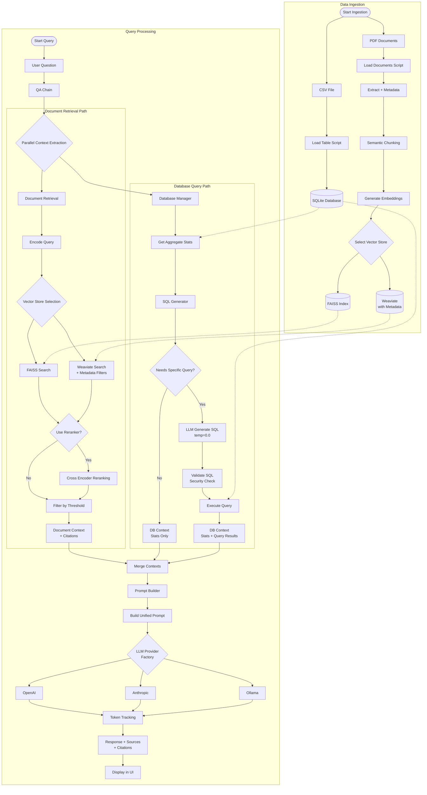
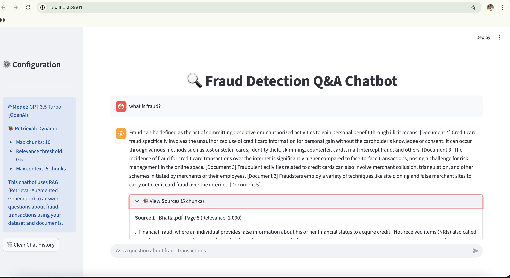
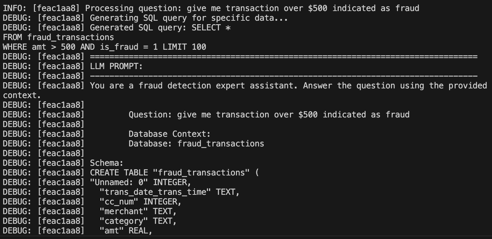
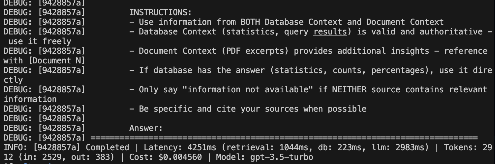

# 🔍 Fraud Detection Q&A Chatbot

An intelligent RAG (Retrieval-Augmented Generation) chatbot for answering questions about fraud transactions. Combines structured transaction data with document-based knowledge using vector search and LLMs.

## 🏗️ Project Architecture

```
fraud-chatbot/
│
├── data/
│   ├── fraud.csv              # Fraud transaction dataset (Kaggle)
│   └── pdfs/                  # PDF documents for RAG
│
├── ingestion/
│   ├── load_table.py          # Load CSV → SQLite
│   └── load_docs.py           # Load PDFs → embeddings
│
├── rag/
│   ├── vector_store.py        # FAISS vector store
│   ├── weaviate_store.py      # Weaviate vector store (metadata support)
│   └── retriever.py           # Backend-agnostic retrieval
│
├── llm/
│   ├── providers/             # Multi-provider LLM abstraction
│   │   ├── base.py            # Base provider interface
│   │   ├── factory.py         # Provider factory pattern
│   │   ├── openai_provider.py # OpenAI implementation
│   │   ├── anthropic_provider.py # Anthropic/Claude implementation
│   │   └── ollama_provider.py # Ollama local models
│   ├── qa_chain.py            # QA chain orchestration
│   ├── db_manager.py          # Database operations manager
│   ├── sql_generator.py       # NL to SQL converter
│   ├── prompt_builder.py      # Prompt templates
│   └── logging_config.py      # Structured logging
│
├── ui/
│   └── app.py                 # Streamlit web interface
│
├── evaluation/
│   ├── scorer.py              # RAGAS-based evaluation
│   ├── test_dataset.py        # Test cases for evaluation
│   ├── run_evaluation.py      # Batch evaluation script
│   ├── example.py             # Single evaluation example
│   └── README.md              # Evaluation documentation
│
├── docker-compose.yml         # Weaviate service configuration
├── database.db                # SQLite database
├── requirements.txt           # Python dependencies
├── debug_chunks.py            # Debug utility for embeddings
├── test_table_retrieval.py    # Retrieval testing script
├── WEAVIATE_MIGRATION.md      # Migration guide (FAISS → Weaviate)
└── README.md
```

## 📊 System Architecture Flow

The chatbot uses a **hybrid RAG architecture** that combines structured database queries with document retrieval for comprehensive answers.



### 🔑 Key Components

| Component | Technology | Purpose |
|-----------|-----------|---------|
| **Embeddings** | SentenceTransformers (all-MiniLM-L6-v2 / all-mpnet-base-v2) | Convert text to 384/768-dim vectors |
| **Vector Store** | **FAISS or Weaviate** (configurable) | Fast similarity search; Weaviate adds metadata support |
| **Retrieval** | Bi-encoder + Optional Cross-encoder | Two-stage ranking for better quality |
| **Database** | SQLite + pandas | Structured fraud transaction queries |
| **SQL Generation** | **LLM-powered** (via `SQLGenerator`) | Dynamic query generation from natural language |
| **LLM Providers** | **OpenAI / Anthropic / Ollama** | Multi-provider abstraction with token tracking |
| **Prompt Builder** | Template system | Consistent prompt formatting across operations |
| **UI** | Streamlit | Interactive chat interface |
| **Docker** | Weaviate service | Containerized vector database deployment |
| **Evaluation** | RAGAS | Quality metrics (see [evaluation/README.md](evaluation/README.md)) |

### 🏛️ Architecture Patterns

The project implements modern software design patterns for maintainability and extensibility:

| Pattern | Implementation | Purpose |
|---------|----------------|---------|
| **Strategy Pattern** | `BaseLLMProvider` abstraction | Swap LLM backends without code changes |
| **Factory Pattern** | `LLMProviderFactory` | Centralized provider creation and registration |
| **Builder Pattern** | `LLMRequestBuilder`, `PromptBuilder` | Fluent API for constructing requests |
| **Repository Pattern** | `DatabaseManager` | Abstract database operations from business logic |

**Example - Provider Abstraction:**
```python
# Switch providers without changing application code
provider = LLMProviderFactory.create_provider("openai", "gpt-4")
# or
provider = LLMProviderFactory.create_provider("anthropic", "claude-3-sonnet")
# or  
provider = LLMProviderFactory.create_provider("ollama", "llama2")

# Same interface for all providers
response = provider.generate(request)
```

This design allows for:
- ✅ Easy A/B testing between providers
- ✅ Zero-downtime provider switching
- ✅ Consistent token tracking across providers
- ✅ Simple addition of new providers

## 🚀 Quick Start

### 1. Installation

```bash
# Clone repository
git clone <your-repo-url>
cd fraud-chatbot

# Create virtual environment
python -m venv venv
source venv/bin/activate  # On Windows: venv\Scripts\activate

# Install dependencies
pip install -r requirements.txt
```

### 2. Setup Environment Variables

```bash
# Copy example env file
cp .env.example .env

# Edit .env with your settings
# Required: LLM Provider API Keys
OPENAI_API_KEY=sk-...           # For OpenAI (default)
ANTHROPIC_API_KEY=sk-ant-...     # For Anthropic/Claude

# LLM Configuration
LLM_PROVIDER=openai              # Options: openai, anthropic, ollama
MODEL_NAME=gpt-3.5-turbo         # Model to use

# Vector Store Configuration
VECTOR_STORE=weaviate            # Options: weaviate, faiss
WEAVIATE_URL=http://localhost:8080
WEAVIATE_COLLECTION=FraudDocuments

# Optional: Retrieval Settings
USE_RERANKER=false
RELEVANCE_THRESHOLD=0.7
MAX_CHUNKS=10

# Optional: Logging
LOG_LEVEL=INFO
```

### 3. Start Weaviate (Recommended)

**Using Docker Compose:**
```bash
# Start Weaviate vector database
docker-compose up -d

# Verify it's running
curl http://localhost:8080/v1/meta

# View logs
docker-compose logs -f weaviate

# Stop when done
docker-compose down
```

**Alternative: Use FAISS (No Docker Required):**
```bash
# In .env file, set:
VECTOR_STORE=faiss
```

For detailed migration information, see [WEAVIATE_MIGRATION.md](WEAVIATE_MIGRATION.md).

### 4. Download Fraud Dataset

```bash
# Option 1: Using Kaggle API
kaggle datasets download -d mlg-ulb/creditcardfraud
unzip creditcardfraud.zip -d data/

# Option 2: Manual download from Kaggle
# Visit: https://www.kaggle.com/mlg-ulb/creditcardfraud
# Download and place in data/fraud.csv
```

### 5. Prepare Data

```bash
# Load transaction data into SQLite
python ingestion/load_table.py

# Load PDF documents for RAG
# Place PDFs in data/pdfs/ then run:
python ingestion/load_docs.py

# This will:
# - Extract text from PDFs with page metadata
# - Create semantic chunks
# - Generate embeddings
# - Store in selected vector store (Weaviate or FAISS)
```

### 6. Run the Chatbot

```bash
# Launch Streamlit UI
streamlit run ui/app.py
```

Access the chatbot at `http://localhost:8501`

## Demo & Screenshots

### 🎥 Video Demonstration

Watch a full walkthrough of the chatbot in action:

[](https://jam.dev/c/ac01280a-7c37-4e6d-82fa-797614fe2560)

### 🖥️ Application Screenshots

**Streamlit Web Interface**


*Interactive chat interface with fraud detection Q&A capabilities*

**Terminal Application**



*Running the chatbot from the command line*

## 📚 Usage Guide

### Data Ingestion

**Load Transaction Data:**
```python
from ingestion.load_table import load_fraud_data

load_fraud_data("data/fraud.csv", "database.db")
```

**Load Documents for RAG:**
```python
from ingestion.load_docs import load_pdf_documents, chunk_documents, create_embeddings

# Load PDFs
docs = load_pdf_documents("data/pdfs")

# Create chunks
chunks = chunk_documents(docs)

# Generate embeddings
create_embeddings(chunks)
```

### RAG Retrieval

**Basic Retrieval:**
```python
from rag.retriever import Retriever

# Initialize with backend (faiss or weaviate)
retriever = Retriever(backend='weaviate')  # or 'faiss'
retriever.load_vector_store()

# Search for relevant documents
results = retriever.retrieve("What are fraud indicators?", k=5)

# Results include: (text, score, metadata)
for text, score, metadata in results:
    print(f"Score: {score:.3f}")
    print(f"Source: {metadata.get('source', 'N/A')}")
    print(f"Page: {metadata.get('page', 'N/A')}")
    print(f"Text: {text[:200]}...\n")
```

**Weaviate with Metadata Filters:**
```python
# Filter by specific document
results = retriever.retrieve(
    "fraud detection methods",
    k=5,
    filters={"source": "Bhatla.pdf"}
)

# Filter by page range
results = retriever.retrieve(
    "transaction analysis",
    k=5,
    filters={
        "source": "fraud_report.pdf",
        "page": {"$gte": 10, "$lte": 20}
    }
)
```

### Multi-Provider LLM Usage

**Using the Provider Factory:**
```python
from llm.providers import LLMProviderFactory, LLMRequest

# OpenAI
provider = LLMProviderFactory.create_provider("openai", "gpt-4")

# Anthropic/Claude
provider = LLMProviderFactory.create_provider("anthropic", "claude-3-sonnet-20240229")

# Ollama (local models)
provider = LLMProviderFactory.create_provider("ollama", "llama2")

# Generate response
request = LLMRequest(
    prompt="Explain fraud detection techniques",
    temperature=0.7,
    max_tokens=500
)

response = provider.generate(request)
print(f"Answer: {response.content}")
print(f"Tokens: {response.usage.total_tokens}")
print(f"Cost: ${response.cost:.4f}")
```

### QA Chain (Recommended)

```python
from llm.qa_chain import QAChain

# Initialize with your preferred LLM
qa = QAChain(llm_provider="openai", model_name="gpt-3.5-turbo")

# Ask questions
result = qa.ask("What patterns indicate fraudulent transactions?")

# Response includes:
print(result["answer"])              # Generated answer
print(result["sources"])             # Source documents used
print(result["db_context_used"])     # Whether database was queried
print(result["sql_query"])           # SQL query (if generated)
print(result["usage"])               # Token usage breakdown

# For evaluation (RAGAS format)
eval_result = qa.ask_for_evaluation("What are fraud indicators?")
print(eval_result["contexts"])      # List of context strings
```

### SQL Generation

```python
from llm.sql_generator import SQLGenerator
from llm.db_manager import DatabaseManager

# Initialize
db_manager = DatabaseManager("database.db")
sql_gen = SQLGenerator(db_manager, llm_provider="openai")

# Generate SQL from natural language
question = "How many fraudulent transactions were over $500?"
result = sql_gen.generate_and_execute(question)

if result["needs_db_query"]:
    print(f"SQL: {result['sql_query']}")
    print(f"Results: {result['query_results']}")
else:
    print("Question answered with aggregate stats only")
```

For evaluation examples, see the [Testing & Evaluation](#-testing--evaluation) section below.

## 🔧 Configuration

### LLM Provider Settings

Configure via environment variables:

```bash
# Provider Selection
LLM_PROVIDER=openai              # Options: openai, anthropic, ollama
MODEL_NAME=gpt-3.5-turbo         # Model to use

# API Keys
OPENAI_API_KEY=sk-...            # Required for OpenAI
ANTHROPIC_API_KEY=sk-ant-...     # Required for Anthropic

# Ollama Configuration (for local models)
OLLAMA_BASE_URL=http://localhost:11434
```

**Supported Models:**

| Provider | Models | Token Tracking | Cost Tracking |
|----------|--------|----------------|---------------|
| **OpenAI** | gpt-3.5-turbo, gpt-4, gpt-4o, gpt-4o-mini | ✅ | ✅ |
| **Anthropic** | claude-3-opus, claude-3-sonnet, claude-3-haiku, claude-3-5-sonnet | ✅ | ✅ |
| **Ollama** | llama2, mistral, codellama, etc. | ❌ | ❌ (Free) |

### Vector Store Settings

```bash
# Backend Selection
VECTOR_STORE=weaviate            # Options: weaviate, faiss

# Weaviate Configuration
WEAVIATE_URL=http://localhost:8080
WEAVIATE_API_KEY=                # Optional for cloud deployments
WEAVIATE_COLLECTION=FraudDocuments

# FAISS Configuration (when VECTOR_STORE=faiss)
FAISS_INDEX_PATH=./faiss_index  # Path to save/load index
```

**Weaviate vs FAISS:**

| Feature | Weaviate | FAISS |
|---------|----------|-------|
| **Metadata Support** | ✅ (source, page, timestamp) | ❌ |
| **Filtered Search** | ✅ | ❌ |
| **Persistence** | ✅ (automatic) | ⚠️ (manual pickle) |
| **Scalability** | ✅ (cloud-ready) | ⚠️ (single machine) |
| **Setup** | Docker required | No dependencies |
| **Speed** | Fast | Very fast |

### Retrieval Settings

Configure via environment variables:
- `USE_RERANKER=false` - Enable cross-encoder reranking (improves quality by 5-15%)
- `RERANKER_MODEL=cross-encoder/ms-marco-MiniLM-L-6-v2` - Cross-encoder model
- `INITIAL_RETRIEVAL_K=20` - Candidates for reranking
- `MAX_CHUNKS=10` - Maximum chunks to use
- `RELEVANCE_THRESHOLD=0.7` - Minimum similarity score

### Chunking Settings

- `CHUNK_SIZE=1000` - Characters per chunk
- `CHUNK_OVERLAP=200` - Overlap between chunks

### Embedding Models

Default: `all-MiniLM-L6-v2` (384 dimensions)

Alternatives in [rag/retriever.py](rag/retriever.py):
- `EMBEDDING_MODEL=all-mpnet-base-v2` (768 dimensions, higher quality)
- `paraphrase-MiniLM-L6-v2` (384 dimensions, faster)

### SQL Generation Settings

```bash
# Temperature for SQL generation (lower = more deterministic)
SQL_GENERATION_TEMPERATURE=0.0

# Max tokens for SQL queries
SQL_MAX_TOKENS=300
```

### Logging Configuration

```bash
LOG_LEVEL=INFO                   # Options: DEBUG, INFO, WARNING, ERROR
```

## 📊 Dataset Information

**Recommended Datasets:**

1. **Credit Card Fraud Detection** (Kaggle)
   - 284,807 transactions
   - Features: Time, V1-V28 (PCA), Amount, Class
   - Link: https://www.kaggle.com/mlg-ulb/creditcardfraud

2. **IEEE-CIS Fraud Detection** (Kaggle)
   - Identity and transaction data
   - Link: https://www.kaggle.com/c/ieee-fraud-detection

## 🧪 Testing & Evaluation

Evaluate your RAG system quality using the RAGAS framework.

### Running Evaluations

```bash
# Quick evaluation with default settings
python evaluation/run_evaluation.py

# Single question example
python evaluation/example.py

# Advanced options
python evaluation/run_evaluation.py --with-ground-truth --model gpt-4
```

### Evaluation Example

```python
from llm.qa_chain import QAChain
from evaluation.scorer import QAScorer

# Initialize
qa_chain = QAChain()
scorer = QAScorer(use_ground_truth_metrics=False)

# Get answer in RAGAS format
result = qa_chain.ask_for_evaluation("What are fraud indicators?")

# Evaluate
metrics = scorer.evaluate_single(
    question=result["question"],
    answer=result["answer"],
    contexts=result["contexts"]
)

print(f"Context Precision: {metrics['context_precision']:.3f}")
print(f"Answer Relevancy: {metrics['answer_relevancy']:.3f}")
print(f"Faithfulness: {metrics['faithfulness']:.3f}")
```

### RAGAS Metrics

- **context_precision**: Relevance of retrieved contexts
- **answer_relevancy**: Question-answer alignment  
- **faithfulness**: Answer grounded in context
- **context_recall**: Completeness of retrieval (requires ground truth)
- **answer_correctness**: Semantic similarity to expected answer (requires ground truth)

See [evaluation/README.md](evaluation/README.md) for detailed evaluation guide.

## 🛠️ Development

### Project Structure

- **ingestion/**: Data loading and preprocessing
- **rag/**: Vector storage (FAISS/Weaviate) and retrieval logic
- **llm/**: LLM providers, QA chain, SQL generation, database management
- **llm/providers/**: Multi-provider abstraction (Strategy pattern)
- **ui/**: Streamlit web interface
- **evaluation/**: Quality metrics and scoring

### Architecture Patterns

This project implements several design patterns:

1. **Strategy Pattern**: `LLMProvider` abstraction for swappable LLM backends
2. **Factory Pattern**: `LLMProviderFactory` for creating providers
3. **Builder Pattern**: `LLMRequestBuilder` and `PromptBuilder` for request construction
4. **Repository Pattern**: `DatabaseManager` for data access abstraction

### Adding New Features

1. **New LLM Provider**: 
   - Create class in [llm/providers/](llm/providers/) extending `BaseLLMProvider`
   - Implement `generate()` method
   - Register in [llm/providers/factory.py](llm/providers/factory.py)
   - Example: See [llm/providers/openai_provider.py](llm/providers/openai_provider.py)

2. **New Vector Store Backend**:
   - Create class in [rag/](rag/) implementing common interface
   - Update [rag/retriever.py](rag/retriever.py) to support new backend
   - Example: See [rag/weaviate_store.py](rag/weaviate_store.py)

3. **Custom Retrieval Logic**: Modify [rag/retriever.py](rag/retriever.py)

4. **UI Customization**: Edit [ui/app.py](ui/app.py)

5. **New Prompt Templates**: Add to [llm/prompt_builder.py](llm/prompt_builder.py)

6. **Evaluation Metrics**: Add to [evaluation/scorer.py](evaluation/scorer.py)

### Testing & Debugging

**Test Retrieval Quality:**
```bash
python test_table_retrieval.py
```

**Debug Chunk Content:**
```bash
python debug_chunks.py
```

**Run Evaluations:**
```bash
python evaluation/run_evaluation.py
```

## 📝 Dependencies

Key libraries:

**Core RAG & LLM:**
- `ragas` - RAG evaluation framework
- `langchain` - LLM orchestration
- `langchain-openai` - OpenAI integration for RAGAS
- `datasets` - Dataset handling for RAGAS
- `sentence-transformers` - Text embeddings
- `openai` - OpenAI API client
- `anthropic` - Anthropic/Claude API client

**Vector Stores:**
- `faiss-cpu` - FAISS vector similarity search
- `weaviate-client` - Weaviate vector database client (>=4.4.0)

**Infrastructure:**
- `docker` and `docker-compose` - Container orchestration for Weaviate
- `streamlit` - Web UI framework
- `pandas` - Data manipulation
- `sqlite3` - Built-in Python database

**Utilities:**
- `python-dotenv` - Environment variable management
- `pydantic` - Data validation for provider abstractions

See [requirements.txt](requirements.txt) for complete list.

### Installation Notes

**For GPU acceleration (optional):**
```bash
pip uninstall faiss-cpu
pip install faiss-gpu
```

**For local LLM inference:**
```bash
# Install Ollama (macOS)
brew install ollama

# Or download from: https://ollama.ai/download
```

## 🚀 Future Improvements

This project is continuously evolving. Here are planned enhancements for upcoming iterations:

### 🗣️ Conversation Management
- [ ] **Conversation State Persistence**
  - Implement session management to maintain chat history across page refreshes
  - Add conversation memory to enable follow-up questions and context-aware responses
  - Store conversation threads in SQLite for later review and analysis

### 📊 Enhanced Evaluation Pipeline
- [ ] **Automated A/B Testing Framework**
  - Compare different retrieval strategies (with/without reranking, different chunk sizes)
  - Benchmark multiple LLM providers (OpenAI, Anthropic, local models)
  - Generate comparative reports with statistical significance tests

- [ ] **Continuous Monitoring**
  - Log all queries and responses for quality tracking
  - Create dashboard for tracking metrics over time (answer quality, latency)

- [ ] **Expanded Test Dataset**
  - Grow the evaluation dataset from 10 to 100+ diverse questions
  - Cover edge cases and domain-specific fraud scenarios
  - Add adversarial questions to test robustness

### 🔍 Advanced RAG Features
- [ ] **Hybrid Search**
  - Combine semantic search with BM25/keyword search for better recall
  - Implement query expansion and reformulation
  - Add metadata filtering (date ranges, transaction amounts, fraud types)

### 🛡️ Security & Reliability
- [ ] **Input Validation & Sanitization**
  - Implement SQL injection protection for dynamic queries
  - Add rate limiting to prevent abuse
  - Sanitize user inputs before passing to LLM

- [ ] **Error Handling & Fallbacks**
  - Graceful degradation when vector store or database is unavailable
  - Retry logic for API failures with exponential backoff
  - Better error messages with actionable suggestions

### ⚡ Performance Optimization
- [ ] **Caching Layer**
  - Cache frequent queries and their responses
  - Implement semantic similarity caching (return cached results for similar questions)
  - Add Redis for distributed caching in production

- [ ] **Asynchronous Processing**
  - Make retrieval and LLM calls asynchronous for parallel execution
  - Implement background job queue for batch processing
  - Add progress indicators for long-running operations

### 🏗️ Infrastructure
- [ ] **Containerization & Deployment**
  - Create Docker Compose setup for easy deployment
  - Add Kubernetes manifests for scalable production deployment
  - Implement CI/CD pipeline with automated testing

- [ ] **Observability**
  - Add OpenTelemetry instrumentation for distributed tracing
  - Implement structured logging with correlation IDs
  - Create Grafana dashboards for system health monitoring

### 🤖 Model Improvements
- [ ] **Fine-tuning**
  - Fine-tune embedding models on fraud-specific terminology
  - Create domain-adapted LLM for better fraud detection insights
  - Experiment with smaller, specialized models for faster inference

- [ ] **Ensemble Approaches**
  - Combine multiple retrieval methods and rank fusion
  - Use multiple LLMs and aggregate their responses
  - Implement confidence scoring and uncertainty quantification

---

**Priority Order:** Conversation state → Enhanced evaluation → Hybrid search → Caching

Contributions and suggestions for these improvements are welcome! See the [Contributing](#-contributing) section below.

## 🤝 Contributing

Contributions welcome! Please:
1. Fork the repository
2. Create a feature branch
3. Make your changes
4. Submit a pull request

## 📄 License

MIT License - see LICENSE file for details

## 🔗 Resources

### Documentation
- [WEAVIATE_MIGRATION.md](WEAVIATE_MIGRATION.md) - Complete guide for FAISS to Weaviate migration
- [evaluation/README.md](evaluation/README.md) - Detailed evaluation documentation

### External Resources
- [LangChain Documentation](https://python.langchain.com/)
- [Weaviate Documentation](https://weaviate.io/developers/weaviate)
- [FAISS Documentation](https://github.com/facebookresearch/faiss)
- [Streamlit Documentation](https://docs.streamlit.io/)
- [Sentence Transformers](https://www.sbert.net/)
- [RAGAS Documentation](https://docs.ragas.io/)
- [OpenAI API Reference](https://platform.openai.com/docs/api-reference)
- [Anthropic Claude API](https://docs.anthropic.com/claude/reference)
- [Ollama Documentation](https://ollama.ai/)

## � Docker Deployment

### Local Development with Docker

The project includes a [docker-compose.yml](docker-compose.yml) file for running Weaviate locally:

```bash
# Start Weaviate
docker-compose up -d

# Check status
docker-compose ps

# View logs
docker-compose logs -f weaviate

# Stop services
docker-compose down

# Stop and remove volumes (clears data)
docker-compose down -v
```

### Weaviate Configuration

The Docker Compose setup includes:
- **Weaviate** on port 8080 (HTTP) and 50051 (gRPC)
- **Persistent storage** via Docker volume
- **Anonymous access** enabled for local development
- **HNSW indexing** for fast vector search

### Production Deployment

For production, consider:

1. **Weaviate Cloud Services (WCS):**
   ```bash
   WEAVIATE_URL=https://your-cluster.weaviate.network
   WEAVIATE_API_KEY=your-api-key
   ```

2. **Self-hosted Kubernetes:**
   - See [WEAVIATE_MIGRATION.md](WEAVIATE_MIGRATION.md) for scaling guidelines
   - Configure authentication and HTTPS
   - Set up backups and monitoring

3. **Environment Variables for Production:**
   ```bash
   # Use stronger models
   MODEL_NAME=gpt-4
   
   # Increase retrieval quality
   USE_RERANKER=true
   MAX_CHUNKS=15
   
   # Enable detailed logging
   LOG_LEVEL=DEBUG
   ```

## 💡 Tips

1. **Start Small**: Test with a subset of data first
2. **Vector Store Choice**: Use Weaviate for production (metadata, scalability), FAISS for quick prototyping
3. **GPU Acceleration**: Use `faiss-gpu` for large datasets
4. **Cost Management**: Use `gpt-3.5-turbo` for development, `gpt-4` for production
5. **Provider Selection**: Try Ollama for free local inference during development
6. **Document Quality**: Better PDFs = better RAG performance
7. **Chunk Size**: Experiment with 500-2000 character chunks
8. **Metadata Tracking**: Use Weaviate to track source citations for better transparency
9. **SQL Security**: The `SQLGenerator` validates queries, but always review generated SQL
10. **Token Monitoring**: Check token usage in logs to optimize costs

## 🐛 Troubleshooting

### Vector Store Issues

**Issue**: Weaviate connection refused
- **Solution**: Ensure Docker is running: `docker-compose ps`
- **Check**: `curl http://localhost:8080/v1/meta`
- **Logs**: `docker-compose logs weaviate`

**Issue**: Vector store not loading (FAISS)
- **Solution**: Run `python ingestion/load_docs.py` first
- **Check**: Verify `faiss_index` directory exists with index files

**Issue**: "Collection not found" error
- **Solution**: Run ingestion script to create collection
- **Check**: `WEAVIATE_COLLECTION` env variable matches ingestion

### LLM Provider Issues

**Issue**: OpenAI API errors
- **Solution**: Check `OPENAI_API_KEY` in `.env` file
- **Check**: Verify API key has sufficient credits
- **Test**: Run `python -c "import openai; print(openai.api_key)"`

**Issue**: Anthropic rate limits
- **Solution**: Implement retry logic or switch to `gpt-3.5-turbo`
- **Check**: Review usage limits on Anthropic dashboard

**Issue**: Ollama not responding
- **Solution**: Start Ollama server: `ollama serve`
- **Check**: `curl http://localhost:11434/api/tags`
- **Download model**: `ollama pull llama2`

**Issue**: "Provider not found" error
- **Solution**: Check `LLM_PROVIDER` value (must be: openai, anthropic, or ollama)
- **Check**: Verify provider is registered in [llm/providers/factory.py](llm/providers/factory.py)

### Retrieval Quality Issues

**Issue**: Low answer quality
- **Solution**: 
  - Increase `MAX_CHUNKS` (try 15-20)
  - Enable reranker: `USE_RERANKER=true`
  - Lower `RELEVANCE_THRESHOLD` (try 0.5)
  - Use better embedding model: `all-mpnet-base-v2`

**Issue**: Irrelevant documents retrieved
- **Solution**: 
  - Enable cross-encoder reranking
  - Check if PDFs were properly ingested
  - Verify chunk quality: `python debug_chunks.py`

**Issue**: Missing metadata (source, page)
- **Solution**: Switch to Weaviate: `VECTOR_STORE=weaviate`
- **Note**: FAISS doesn't support metadata

### SQL Generation Issues

**Issue**: SQL syntax errors
- **Solution**: 
  - Check database schema: Run `sqlite3 database.db ".schema"`
  - Review generated SQL in logs
  - Lower temperature: `SQL_GENERATION_TEMPERATURE=0.0`

**Issue**: "SQL validation failed" error
- **Solution**: This is a security feature blocking dangerous operations
- **Check**: Review blocked operations in [llm/sql_generator.py](llm/sql_generator.py)

**Issue**: Query timeout
- **Solution**: 
  - Simplify question
  - Add indexes to database
  - Check query results aren't too large

### Performance Issues

**Issue**: Slow retrieval
- **Solution**: 
  - Use smaller embedding model: `all-MiniLM-L6-v2`
  - Enable GPU: `pip install faiss-gpu`
  - Reduce `MAX_CHUNKS` to 5-8
  - Use Weaviate with HNSW indexing

**Issue**: High token costs
- **Solution**: 
  - Switch to `gpt-3.5-turbo` or Ollama
  - Reduce `MAX_CHUNKS`
  - Monitor usage: Check logs for token counts

### Docker Issues

**Issue**: Port 8080 already in use
- **Solution**: 
  - Stop conflicting service: `lsof -ti:8080 | xargs kill`
  - Or change port in [docker-compose.yml](docker-compose.yml)

**Issue**: Weaviate data persists after restart
- **Solution**: This is expected behavior (persistent volumes)
- **To clear**: `docker-compose down -v`

### Getting Help

Still stuck? Check:
1. [WEAVIATE_MIGRATION.md](WEAVIATE_MIGRATION.md) - Detailed migration guide
2. [evaluation/README.md](evaluation/README.md) - Evaluation documentation
3. GitHub Issues - Search for similar problems
4. Enable debug logging: `LOG_LEVEL=DEBUG`

