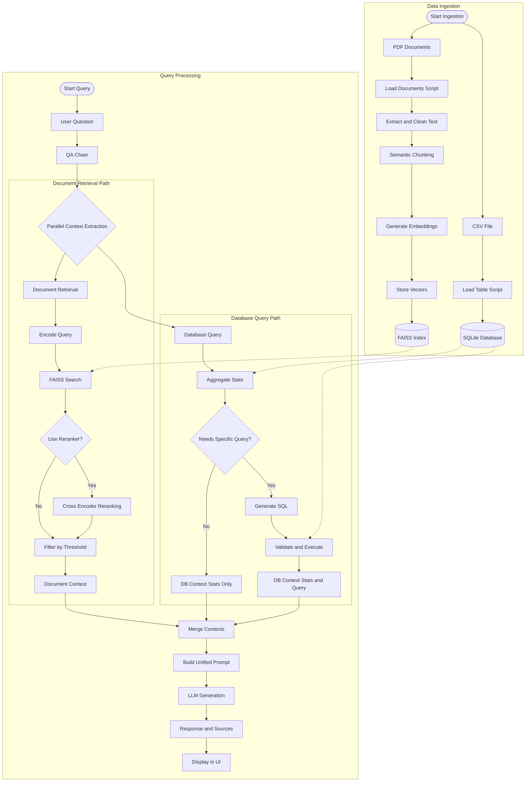

# 🔍 Fraud Detection Q&A Chatbot

An intelligent RAG (Retrieval-Augmented Generation) chatbot for answering questions about fraud transactions. Combines structured transaction data with document-based knowledge using vector search and LLMs.

## 🏗️ Project Architecture

```
fraud-chatbot/
│
├── data/
│   └── fraud.csv              # Fraud transaction dataset (Kaggle)
│
├── ingestion/
│   ├── load_table.py          # Load CSV → SQLite
│   └── load_docs.py           # Load PDFs → embeddings
│
├── rag/
│   ├── vector_store.py        # FAISS vector store
│   └── retriever.py           # Document retrieval
│
├── llm/
│   └── qa_chain.py            # QA chain (retriever + LLM)
│
├── ui/
│   └── app.py                 # Streamlit web interface
│
├── evaluation/
│   ├── scorer.py              # RAGAS-based evaluation
│   ├── test_dataset.py        # Test cases for evaluation
│   ├── run_evaluation.py      # Batch evaluation script
│   ├── example.py             # Single evaluation example
│   └── README.md              # Evaluation documentation
│
├── database.db                # SQLite database
├── requirements.txt           # Python dependencies
└── README.md
```

## 📊 System Architecture Flow

The chatbot uses a **hybrid RAG architecture** that combines structured database queries with document retrieval for comprehensive answers.



### 🔑 Key Components

| Component | Technology | Purpose |
|-----------|-----------|---------|
| **Embeddings** | SentenceTransformers (all-MiniLM-L6-v2) | Convert text to 384-dim vectors |
| **Vector Store** | FAISS IndexFlatIP | Fast cosine similarity search |
| **Retrieval** | Bi-encoder + Optional Cross-encoder | Two-stage ranking for better quality |
| **Database** | SQLite + pandas | Structured fraud transaction queries |
| **LLM** | OpenAI/Anthropic/Ollama | Answer generation from context |
| **UI** | Streamlit | Interactive chat interface |
| **Evaluation** | RAGAS | Quality metrics (see [evaluation/README.md](evaluation/README.md)) |

## 🚀 Quick Start

### 1. Installation

```bash
# Clone repository
git clone <your-repo-url>
cd fraud-chatbot

# Create virtual environment
python -m venv venv
source venv/bin/activate  # On Windows: venv\Scripts\activate

# Install dependencies
pip install -r requirements.txt
```

### 2. Setup Environment Variables

```bash
# Copy example env file
cp .env.example .env

# Edit .env with your API keys
# - OPENAI_API_KEY
```

### 3. Download Fraud Dataset

```bash
# Option 1: Using Kaggle API
kaggle datasets download -d mlg-ulb/creditcardfraud
unzip creditcardfraud.zip -d data/

# Option 2: Manual download from Kaggle
# Visit: https://www.kaggle.com/mlg-ulb/creditcardfraud
# Download and place in data/fraud.csv
```

### 4. Prepare Data

```bash
# Load transaction data into SQLite
python ingestion/load_table.py

# (Optional) Load PDF documents for RAG
# Place PDFs in data/pdfs/ then run:
python ingestion/load_docs.py
```

### 5. Run the Chatbot

```bash
# Launch Streamlit UI
streamlit run ui/app.py
```

Access the chatbot at `http://localhost:8501`

## 📚 Usage Guide

### Data Ingestion

**Load Transaction Data:**
```python
from ingestion.load_table import load_fraud_data

load_fraud_data("data/fraud.csv", "database.db")
```

**Load Documents for RAG:**
```python
from ingestion.load_docs import load_pdf_documents, chunk_documents, create_embeddings

# Load PDFs
docs = load_pdf_documents("data/pdfs")

# Create chunks
chunks = chunk_documents(docs)

# Generate embeddings
create_embeddings(chunks)
```

### RAG Retrieval

```python
from rag.retriever import Retriever

retriever = Retriever()
retriever.load_vector_store()

# Search for relevant documents
results = retriever.retrieve("What are fraud indicators?", k=5)
```

### QA Chain

```python
from llm.qa_chain import QAChain

# Initialize with your preferred LLM
qa = QAChain(llm_provider="openai", model_name="gpt-3.5-turbo")

# Ask questions
result = qa.ask("What patterns indicate fraudulent transactions?")
print(result["answer"])
```

For evaluation examples, see the [Testing & Evaluation](#-testing--evaluation) section below.

## 🔧 Configuration

### Retrieval Settings

Configure via environment variables:
- `USE_RERANKER=false` - Enable cross-encoder reranking (improves quality by 5-15%)
- `RERANKER_MODEL=cross-encoder/ms-marco-MiniLM-L-6-v2` - Cross-encoder model
- `INITIAL_RETRIEVAL_K=20` - Candidates for reranking
- `MAX_CHUNKS=10` - Maximum chunks to use
- `RELEVANCE_THRESHOLD=0.7` - Minimum similarity score

### Chunking Settings

- `CHUNK_SIZE=1000` - Characters per chunk
- `CHUNK_OVERLAP=200` - Overlap between chunks

### Embedding Models

Default: `all-MiniLM-L6-v2` (384 dimensions)

Alternatives in [rag/retriever.py](rag/retriever.py):
- `EMBEDDING_MODEL=all-mpnet-base-v2` (768 dimensions, higher quality)
- `paraphrase-MiniLM-L6-v2` (384 dimensions, faster)

### Vector Store

FAISS is used by default. For GPU acceleration:
```bash
pip uninstall faiss-cpu
pip install faiss-gpu
```

## 📊 Dataset Information

**Recommended Datasets:**

1. **Credit Card Fraud Detection** (Kaggle)
   - 284,807 transactions
   - Features: Time, V1-V28 (PCA), Amount, Class
   - Link: https://www.kaggle.com/mlg-ulb/creditcardfraud

2. **IEEE-CIS Fraud Detection** (Kaggle)
   - Identity and transaction data
   - Link: https://www.kaggle.com/c/ieee-fraud-detection

## 🧪 Testing & Evaluation

Evaluate your RAG system quality using the RAGAS framework.

### Running Evaluations

```bash
# Quick evaluation with default settings
python evaluation/run_evaluation.py

# Single question example
python evaluation/example.py

# Advanced options
python evaluation/run_evaluation.py --with-ground-truth --model gpt-4
```

### Evaluation Example

```python
from llm.qa_chain import QAChain
from evaluation.scorer import QAScorer

# Initialize
qa_chain = QAChain()
scorer = QAScorer(use_ground_truth_metrics=False)

# Get answer in RAGAS format
result = qa_chain.ask_for_evaluation("What are fraud indicators?")

# Evaluate
metrics = scorer.evaluate_single(
    question=result["question"],
    answer=result["answer"],
    contexts=result["contexts"]
)

print(f"Context Precision: {metrics['context_precision']:.3f}")
print(f"Answer Relevancy: {metrics['answer_relevancy']:.3f}")
print(f"Faithfulness: {metrics['faithfulness']:.3f}")
```

### RAGAS Metrics

- **context_precision**: Relevance of retrieved contexts
- **answer_relevancy**: Question-answer alignment  
- **faithfulness**: Answer grounded in context
- **context_recall**: Completeness of retrieval (requires ground truth)
- **answer_correctness**: Semantic similarity to expected answer (requires ground truth)

See [evaluation/README.md](evaluation/README.md) for detailed evaluation guide.

## 🛠️ Development

### Project Structure

- **ingestion/**: Data loading and preprocessing
- **rag/**: Vector storage and retrieval logic
- **llm/**: LLM integration and QA chain
- **ui/**: Streamlit web interface
- **evaluation/**: Quality metrics and scoring

### Adding New Features

1. **Custom Retrieval**: Modify [rag/retriever.py](rag/retriever.py)
2. **New LLM Provider**: Extend [llm/qa_chain.py](llm/qa_chain.py)
3. **UI Customization**: Edit [ui/app.py](ui/app.py)
4. **Evaluation Metrics**: Add to [evaluation/scorer.py](evaluation/scorer.py)

## 📝 Dependencies

Key libraries:
- `ragas` - RAG evaluation framework
- `langchain` - LLM orchestration
- `langchain-openai` - OpenAI integration for RAGAS
- `datasets` - Dataset handling for RAGAS
- `faiss-cpu` - Vector similarity search
- `sentence-transformers` - Text embeddings
- `streamlit` - Web UI
- `pandas` - Data manipulation
- `openai` / `anthropic` - LLM APIs

See [requirements.txt](requirements.txt) for complete list.

## 🤝 Contributing

Contributions welcome! Please:
1. Fork the repository
2. Create a feature branch
3. Make your changes
4. Submit a pull request

## 📄 License

MIT License - see LICENSE file for details

## 🔗 Resources

- [LangChain Documentation](https://python.langchain.com/)
- [FAISS Documentation](https://github.com/facebookresearch/faiss)
- [Streamlit Documentation](https://docs.streamlit.io/)
- [Sentence Transformers](https://www.sbert.net/)

## 💡 Tips

1. **Start Small**: Test with a subset of data first
2. **GPU Acceleration**: Use `faiss-gpu` for large datasets
3. **Cost Management**: Use `gpt-3.5-turbo` for development, `gpt-4` for production
4. **Document Quality**: Better PDFs = better RAG performance
5. **Chunk Size**: Experiment with 500-2000 character chunks

## 🐛 Troubleshooting

**Issue**: Vector store not loading
- **Solution**: Run `python ingestion/load_docs.py` first

**Issue**: LLM API errors
- **Solution**: Check API keys in `.env` file

**Issue**: Low answer quality
- **Solution**: Increase number of retrieved documents (k parameter)

**Issue**: Slow retrieval
- **Solution**: Use smaller embedding model or GPU acceleration

